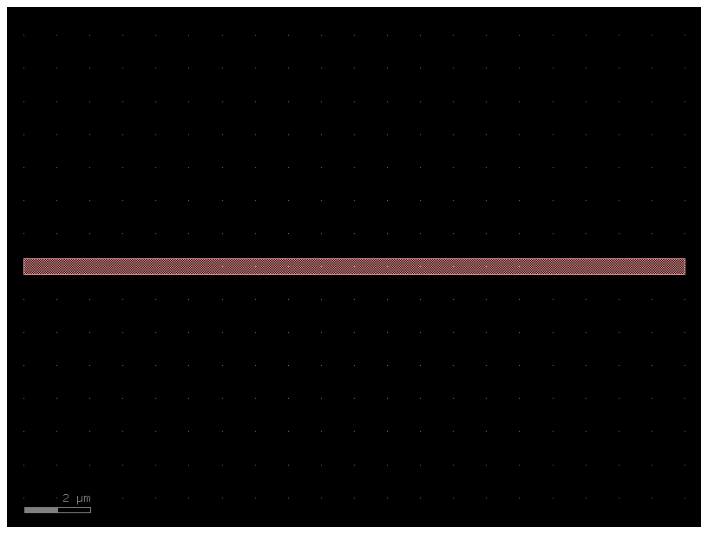
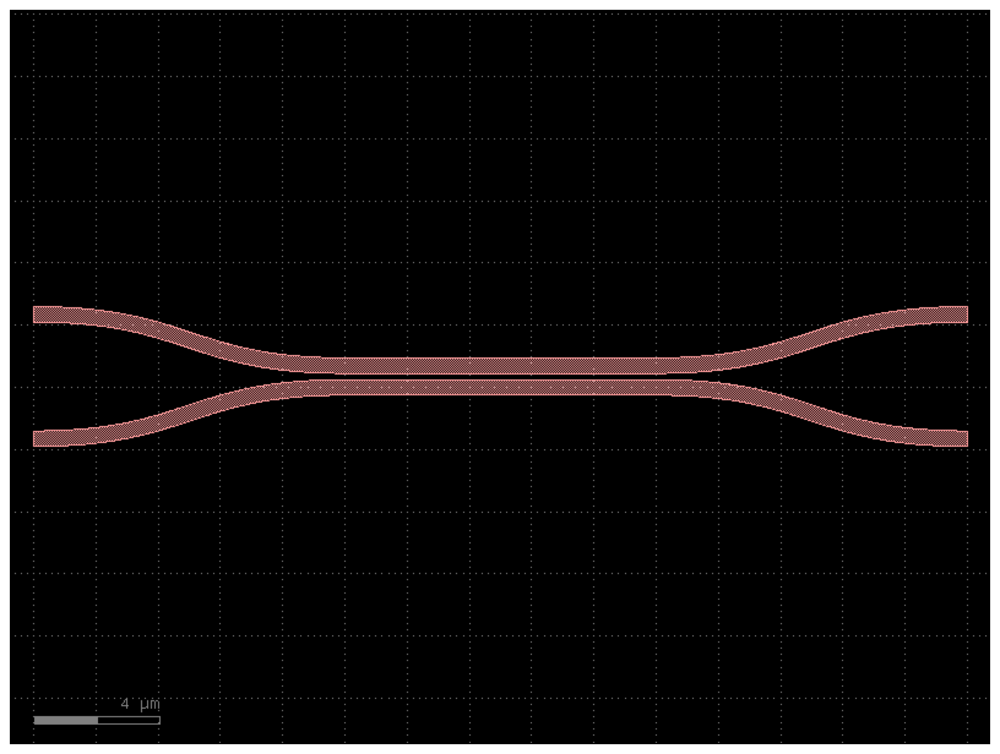
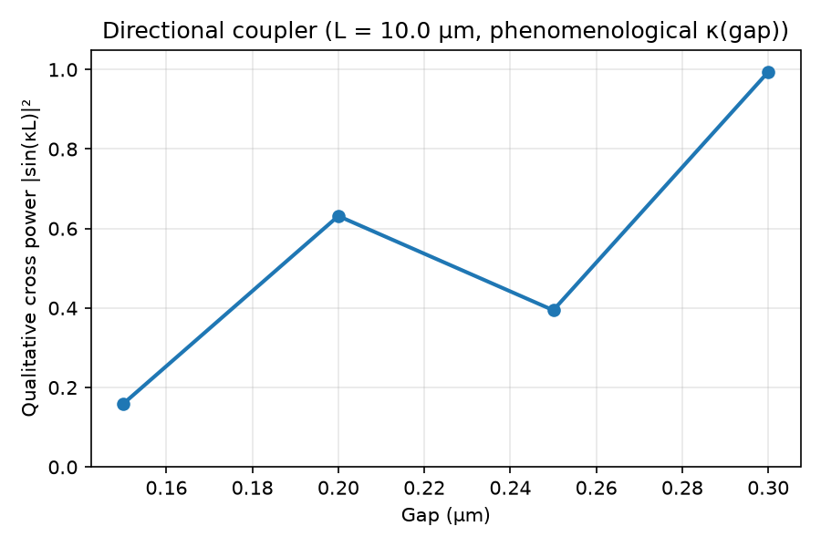
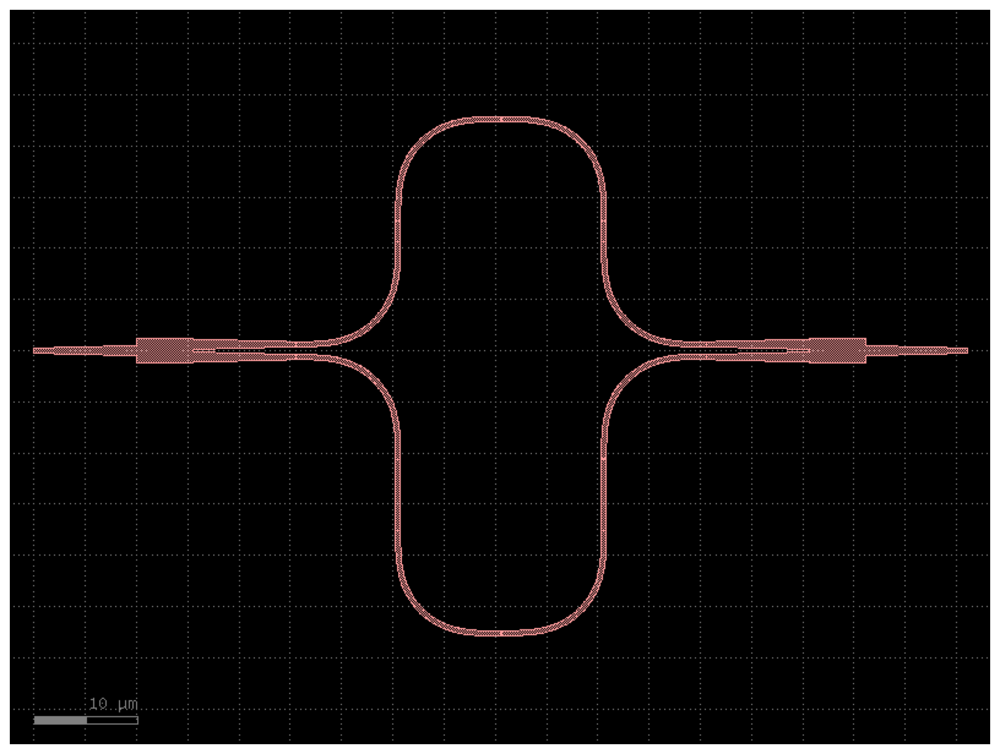
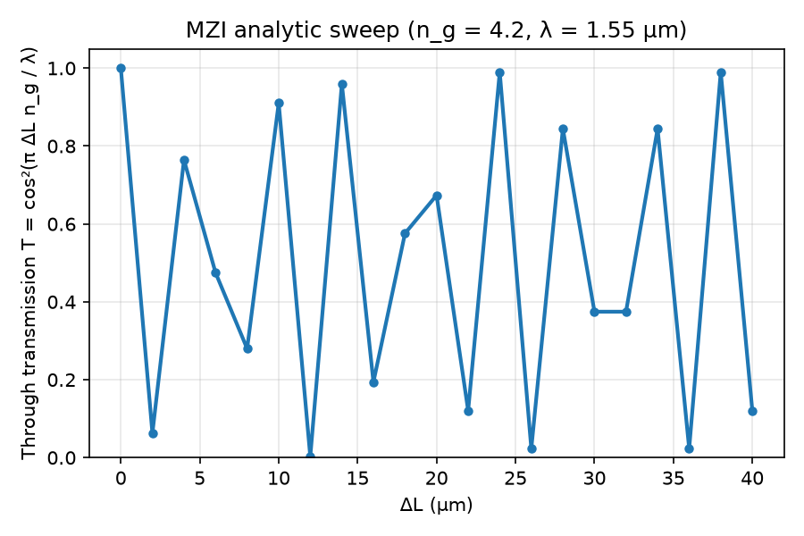
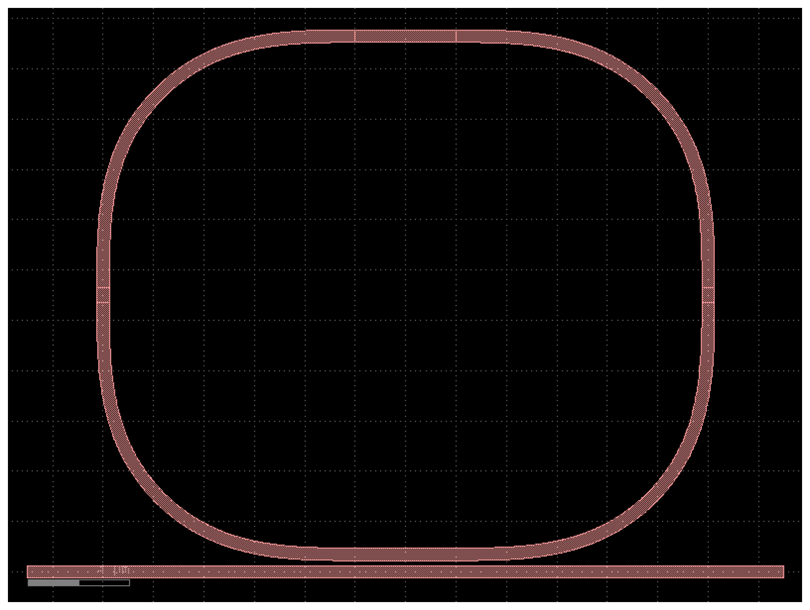

# PIC Component Library

Parametric **layout-only** silicon photonics cells in [GDSFactory](https://gdsfactory.github.io/gdsfactory/). No simulation in this repo—only geometry you could send to a fab flow later.

Components are added **one at a time**, with physics notes in this README so you know exactly what each pushed file represents.

## Repository layout

```text
├── README.md                 # What each component is and how to install
├── pyproject.toml            # Python 3.11 + gdsfactory (pip install -e .)
├── requirements.txt          # Pinned deps for reproducible CI
├── components/               # One Python file per cell (only finished cells in __init__)
├── scripts/
│   ├── verify_install.py     # Week 1: import gdsfactory, build a straight
│   └── export_gds.py         # Write gds_outputs/*.gds and assets/*.png
├── tests/                    # pytest: ports, GDS write, cell registration
├── notebooks/                # Demos (added with each component)
├── assets/                   # PNG previews embedded in README
└── gds_outputs/              # Example GDS committed for each implemented cell
```

## Install (GitHub / pip only)

Requires **Python 3.11** (GDSFactory supports 3.11–3.13).

```bash
git clone https://github.com/Shahbaz-z/PIC-component-Library.git
cd PIC-component-Library
python3.11 -m venv .venv
source .venv/bin/activate   # Windows: .venv\Scripts\activate
pip install -e ".[dev]"
python scripts/verify_install.py
```

GDSFactory 9+ needs an active PDK. Importing from `components` activates the generic PDK (`gf.gpdk`) automatically.

Optional local GDS viewer (not used in CI):

```bash
pip install -e ".[viewer]"   # installs klayout; then component.show() may open KLayout
```

## What gets pushed to GitHub

| Path | Purpose |
|------|---------|
| `components/*.py` | Source for each parametric cell (`@gf.cell` functions) |
| `gds_outputs/*.gds` | Binary layout exported from those cells (default parameters) |
| `assets/*.png` | 2D preview from `component.plot()` for the README |
| `.github/workflows/ci.yml` | Runs tests + re-exports on every push/PR |

When a new component is added, `scripts/export_gds.py` and `tests/test_components.py` are extended so CI proves the new cell builds and writes GDS.

---

## Component 1: Strip waveguide (`my_waveguide`)

**Status:** implemented — [`components/waveguide.py`](components/waveguide.py)

### What it is

A **strip waveguide** is a silicon ridge (core) on buried oxide. In the SOI platform, the wafer often uses ~220 nm thick Si; your layout draws the **in-plane** core width and length. The thickness is defined by the process design kit (PDK), not by this 2D cell.

### How light is guided

- Light is confined by **total internal reflection** at the high-index core vs. low-index cladding (SiO₂).
- The fundamental mode is mostly in the core; some field leaks into the cladding (evanescent tail).
- **Width** changes the effective index \(n_\mathrm{eff}\) and how many modes the guide supports: very narrow cores can be single-mode but bend-sensitive; wider cores can become multimode.

### Parameters (layout units: µm)

| Argument | Default | Meaning |
|----------|---------|---------|
| `length` | `10.0` | Distance along the guide between ports |
| `width` | `0.5` | Core width (typical strip range ~0.4–0.6 µm at 1550 nm) |

### Ports

- `o1` — input (one end of the straight)
- `o2` — output (other end)

These names match GDSFactory’s `straight` so you can connect this cell to couplers and rings later.

### Usage

```python
from components.waveguide import my_waveguide

wg = my_waveguide(length=20.0, width=0.45)
wg.plot()          # matplotlib preview
# wg.show()        # optional: KLayout if .[viewer] installed
print(wg.ports)
```

Regenerate committed artifacts:

```bash
python scripts/export_gds.py
```

### Preview



---


---

## Component 2: Directional coupler (`my_directional_coupler`)

**Status:** implemented — [`components/directional_coupler.py`](components/directional_coupler.py)

### What it is

A **directional coupler** is two parallel strip waveguides placed close enough that their optical modes overlap. Power is exchanged between the guides by **evanescent coupling** in the straight section; S-bends separate the buses afterward so you get four accessible ports.

### How coupling works (CMT, no simulation here)

In **coupled-mode theory**, each guide carries a mode amplitude. The coupling coefficient κ (rad/µm in this layout-centric view) sets how fast energy sloshes between guides:
--- This is the same physics seen with coupled oscillators, but adapted for waves ----

- **Smaller gap** → stronger evanescent overlap → larger κ.
- **Longer `coupling_length`** → more accumulated phase Δφ = κ L → more (or less) power transferred.

For a symmetric coupler, a common result is that the **cross-port power fraction** scales as |sin(κ L)|². A **50:50 splitter** occurs when κ L = π/2, i.e. at the **coupling length** L_c = π / (2κ). This repo does not compute κ from Maxwell’s equations; you sweep `gap` and `coupling_length` in layout and validate later in measurement or EM tools.

### Parameters (layout units: µm)

| Argument | Default | Meaning |
|----------|---------|---------|
| `gap` | `0.2` | Edge-to-edge spacing between the two strip cores in the coupling region |
| `coupling_length` | `10.0` | Length of the parallel coupling section |
| `width` | `0.5` | Strip width of both guides |
| `dx` | `10.0` | Horizontal offset from coupling region to bend (port spacing in x) |
| `dy` | `4.0` | Centerline separation of the two buses outside the coupler |

### Ports (GDSFactory convention)

| Port | Typical role |
|------|----------------|
| `o1` | Input on upper bus |
| `o2` | Through / bar port on upper bus |
| `o3` | Cross port on lower bus |
| `o4` | Input on lower bus |

Exact routing follows `gf.components.coupler`; use `print(dc.ports)` on an instance to inspect coordinates before connecting in a circuit.

### Usage

```python
from components import my_directional_coupler

dc = my_directional_coupler(gap=0.2, coupling_length=10.0, width=0.5)
dc.plot()
print(dc.ports)
```

### Gap sweep (layout + qualitative plot)

`scripts/export_gds.py` writes:

- `gds_outputs/directional_coupler_example.gds` — default parameters above
- `gds_outputs/sweeps/coupler_gap*.gds` — same `coupling_length`, gaps 0.15–0.30 µm (CI artifact; not committed)
- `assets/coupler_gap_sweep.png` — |sin(κ L)|² vs gap using `cross_power_fraction()` (phenomenological κ(gap), for trend only)

```python
from components.directional_coupler import cross_power_fraction

eta = cross_power_fraction(coupling_length=10.0, gap=0.2)
```

### Interpreting the gap sweep

The plot uses a phenomenological model κ(gap) = κ_scale·exp(−gap/decay) with κ_scale = 3.0 and decay = 0.1 µm, then η = |sin(κL)|². At the default gap = 0.2 µm and L = 10 µm, κL ≈ 4.06 so η ≈ 0.63 (~63% cross, ~37% bar)—the device is **over-coupled** past the first 50:50 point. A 50:50 splitter needs κL = π/2; in this model that occurs near **gap ≈ 0.30 µm** at L = 10 µm.

Cross power is **not monotonic in gap** at fixed L: smaller gap increases κ, advancing Δφ = κL along a sin² oscillation so power can slosh back to the bar port (e.g. gap = 0.15 µm → η ≈ 0.16). The sweep GDS files show layout geometry only; the PNG connects layout knobs to expected qualitative trend, not measured splitting. κ(gap) is illustrative—Project 2 (Tidy3D) will validate against EM simulation.

### Previews






## Component 3: Mach–Zehnder interferometer (`my_mzi`)

**Status:** implemented — [`components/mzi.py`](components/mzi.py)

### What it is

A **Mach–Zehnder interferometer (MZI)** splits light with a first directional coupler, propagates it through two arms of different length, then recombines with a second coupler. The path difference \(\Delta L\) creates a phase shift between arms.

### How it works

For a symmetric 50:50 MZI, the through-port transmission is:

\[
T = \cos^2\!\left(\frac{\pi \Delta L \cdot n_g}{\lambda}\right)
\]

where \(n_g\) is the group index and \(\lambda\) is the wavelength. Changing `delta_length` shifts the interference fringe pattern. The MZI is built from two couplers (see Component 2) connected by waveguide arms.

### Parameters (layout units: µm)

| Argument | Default | Meaning |
|----------|---------|---------|
| `delta_length` | `10.0` | Path length difference between the two arms |
| `bend_radius` | `10.0` | Bend radius in the MZI arms |

### Ports

Two optical ports (`o1`, `o2`) following GDSFactory `mzi` convention (input and output). Use `print(mzi.ports)` to inspect coordinates.

### Usage

```python
from components import my_mzi
from components.mzi import mzi_transmission

mzi = my_mzi(delta_length=10.0, bend_radius=10.0)
mzi.plot()
print(mzi.ports)

T = mzi_transmission(delta_length=10.0)  # qualitative analytic T
```

### Previews






## Component 4: Ring resonator (`my_ring`)

**Status:** implemented — [`components/ring_resonator.py`](components/ring_resonator.py)

### What it is

A **ring resonator** couples light from a straight bus waveguide into a closed ring via evanescent overlap. At resonance, power builds up in the ring; off resonance, light passes through the bus.

### How it works

Resonance condition (round-trip phase):

\[
2\pi r \cdot n_\mathrm{eff} = m \lambda
\]

Free spectral range (spacing between adjacent resonances):

\[
\mathrm{FSR} \approx \frac{\lambda^2}{n_g \cdot L}, \quad L = 2\pi r
\]

For Si at 1550 nm, \(n_\mathrm{eff} \approx 2.4\) is a typical order-of-magnitude estimate. Coupling strength and Q are set by `gap` and `radius` in layout.

### Parameters (layout units: µm)

| Argument | Default | Meaning |
|----------|---------|---------|
| `radius` | `10.0` | Bend radius of the ring |
| `gap` | `0.2` | Edge-to-edge gap between bus and ring |
| `width` | `0.5` | Strip width of bus and ring |

### Ports

Bus ports following GDSFactory `ring_single` convention (`o1`, `o2`). Use `print(ring.ports)` to inspect.

### Usage

```python
from components import my_ring
from components.ring_resonator import ring_fsr

ring = my_ring(radius=10.0, gap=0.2, width=0.5)
ring.plot()
print(ring.ports)

fsr = ring_fsr(radius=10.0)  # µm, qualitative
```

### Preview



## License

MIT — see [LICENSE](LICENSE).
